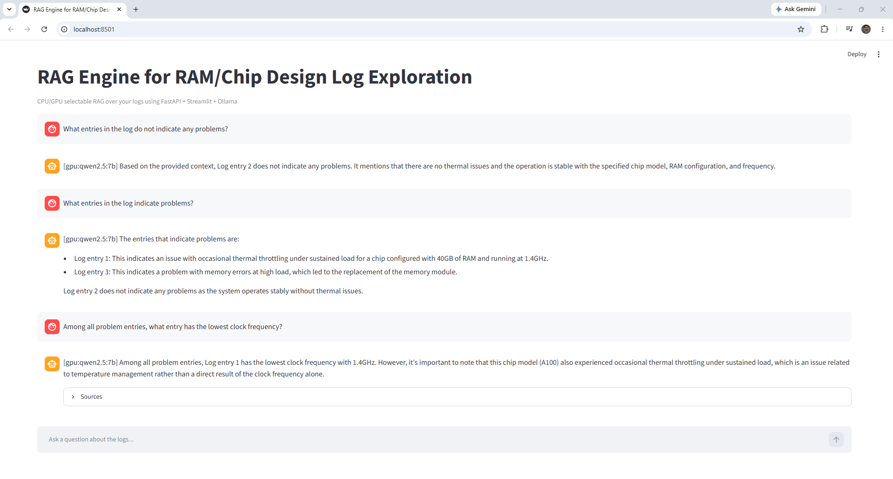

# RAM / Chip Log RAG Demo

A local RAG app that lets you query RAM/chip design logs through a FastAPI backend and a Streamlit frontend powered by Ollama.



## Overview

This project indexes a pre-existing log file, retrieves the most relevant chunks using FAISS, and sends them to a local Ollama model for answer generation. The frontend uses Streamlit chat UI to let you ask questions in natural language.

## Features

- FastAPI backend for RAG queries.
- Streamlit frontend with chat-style interface.
- Local Ollama integration for CPU or GPU inference.
- FAISS vector store for fast similarity search.
- CPU/GPU mode switching through environment variables.
- Source snippets returned with each answer for debugging.

## Project Structure

```text
RAM-Chip-Log-RAG-Demo/
  requirements.txt
  data/
    ram_log.txt
  backend/
    config.py
    index.py
    main.py
  frontend/
    app.py
```

## Prerequisites

- Windows 11 or another supported OS.
- Python 3.10+.
- Ollama installed and running locally at `http://localhost:11434`.
- A virtual environment is recommended.

## Recommended Models

- CPU: `llama3.2:3b`
- GPU with 12GB VRAM: `qwen2.5:7b`

Pull them once:

```command
ollama pull llama3.2:3b
ollama pull qwen2.5:7b
```

## Setup

### 1) Create and activate a virtual environment

```command
python -m venv .venv
.venv\Scripts\activate
```

### 2) Install the dependencies

```command
pip install -r requirements.txt
```

### 4) Add your log file

Place your RAM/chip design log in:

```text
data/ram_log.txt
```

## Step 1: Log Indexing

Build the FAISS index from your log file:

```command
python backend/index.py
```

This creates the vector index used by the backend for retrieval.

## Step 2: Set Environment Variable for CPU or GPU Mode (Optional)

This is an optional step. The application automatically determines if an Nvidia GPU is installed. If installed, it runs the RAG application on the GPU, else CPU is used. If a GPU is installed and you still want to test the application on CPU, set RUN_MODE to cpu.

In Windows Command Prompt:

```command
set RUN_MODE=cpu
```

## Step 3: Run the Back-End
```command
uvicorn backend.main:app --host 0.0.0.0 --port 8000
```

## Step 4: Run the Front-End App

Then start Streamlit:

```command
streamlit run frontend/app.py
```

Open the local Streamlit URL in your browser, usually:

```text
http://localhost:8501
```

## Step 5: Sample Questions

Try these questions in the chat UI:

- Question 1: What entries in the log do not indicate any problems?
- Question 2: What entries in the log indicate problems?
- Question 3: Among all problem entries, what entry has the lowest clock frequency?

## API Endpoints

### `GET /health`

Returns:

- backend status
- selected run mode
- selected model
- Ollama reachability
- index load state

### `POST /query`

Request body:

```json
{
  "question": "How many entries are there in the log file?"
}
```

Response includes:

- `answer`
- `sources`
- `model`
- `run_mode`